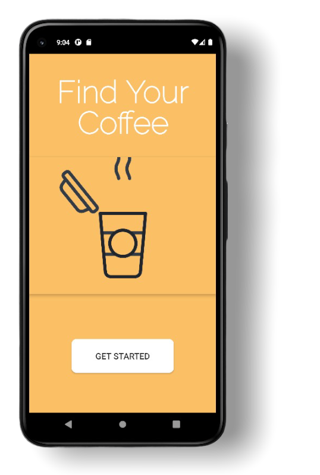
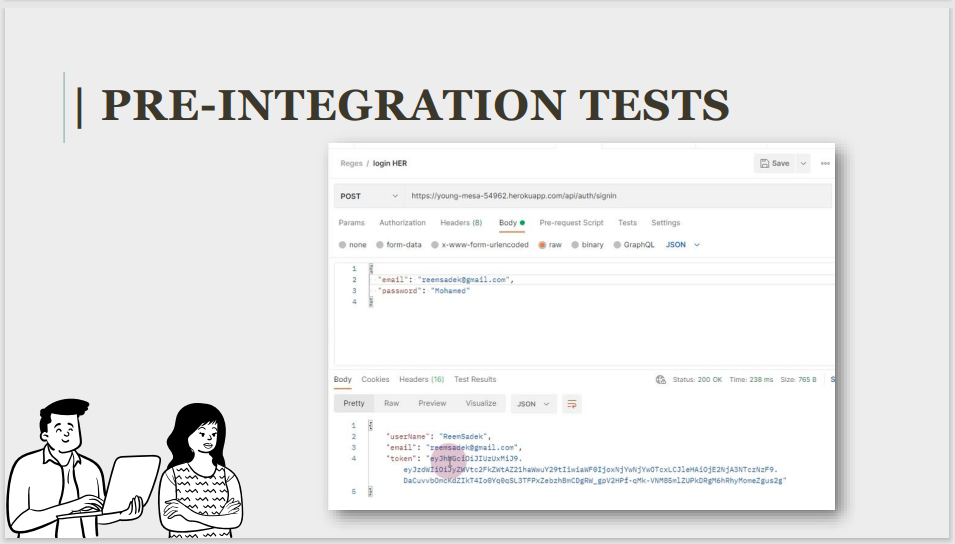
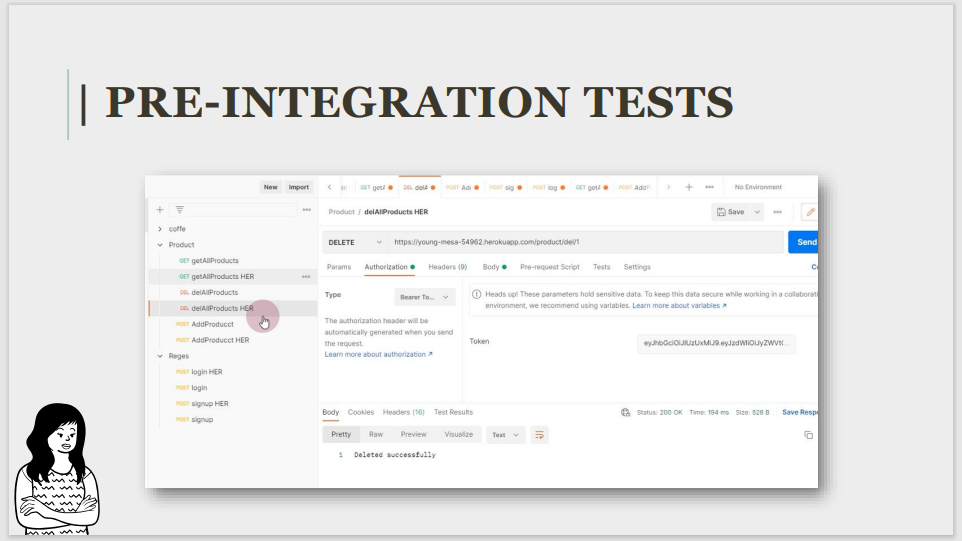

# Coffee Blend - Implementable APIs

## Technologies Used:
 ### Backend:
  Spring Boot , Spring Security, JWT.
 ### Frontend:
Angular Framework
 ### Android App:

### **Android Github**

## UI & Features:

###  SIGNUP

### LOGIN

### Menu 
Menu is retrieved using the APIs

### Cart & Home - Future Work

Using local data

## Pre-Integration Tests (Postman)

## DEMO Video - Website

## DEMO Video - Android App

